                            SELECT PART 2
1. Write a SQL statement that displays all the information about all salespeople.

``sql
    select * from salesman;
``

                            **RESULT**
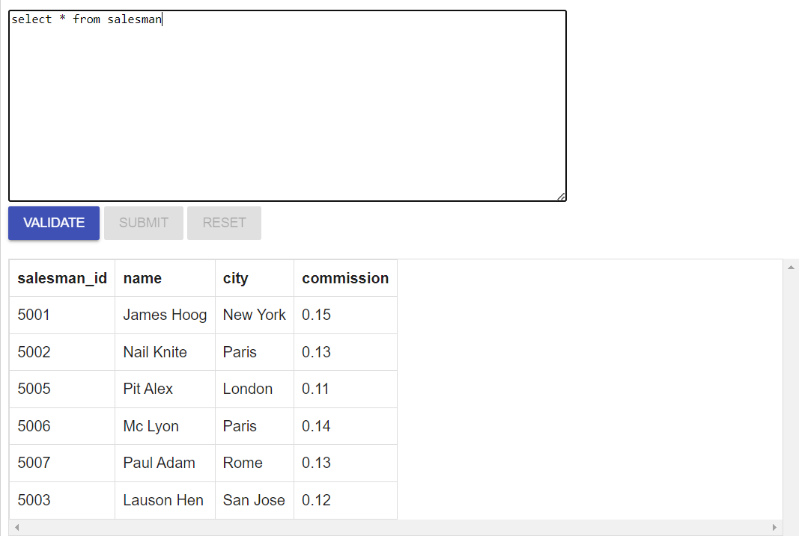

3.Write a SQL statement to display a string "This is SQL Exercise, Practice and Solution".

``sql
select 'This is SQL Exercise, Practice and Solution'
``

                            **RESULT**
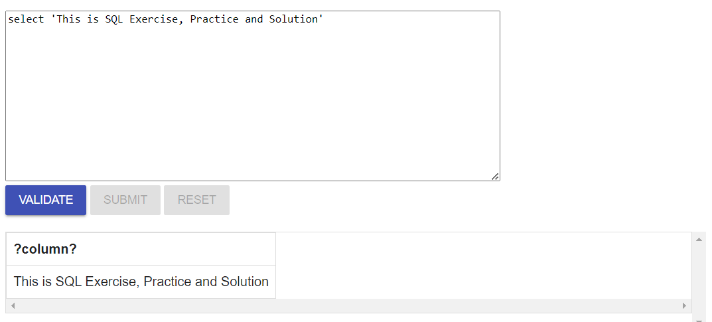

3.Write a SQL query to display three numbers in three columns

``sql
select 5, 10, 15
``

                            **RESULT**

4.Write a SQL query to display the sum of two numbers 10 and 15 from the RDBMS server

``sql
select 10 + 15;
``

                            **RESULT**
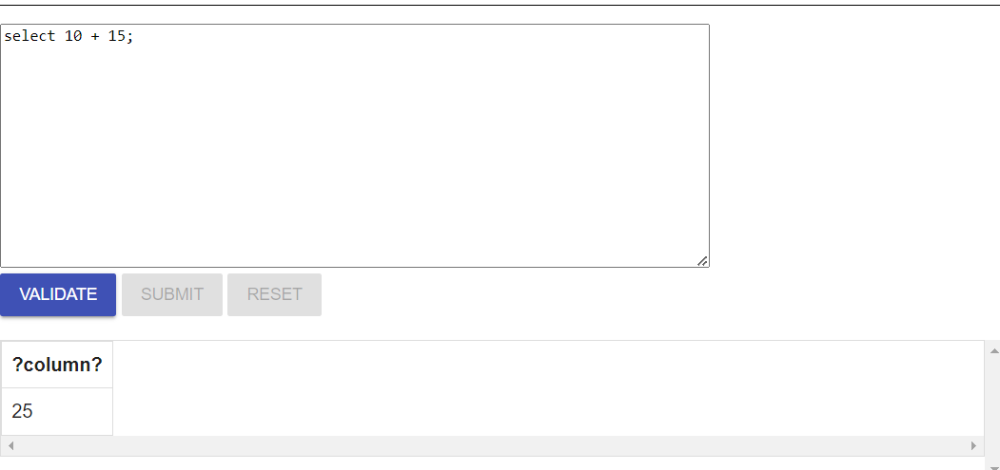

5.Write an SQL query to display the result of an arithmetic expression.

``sql
select 10 + 15 - 5 * 2
``

                            **RESULT**

6.Write a SQL statement to display specific columns such as names and commissions for all salespeople

``sql
select name, commission FROM salesman
``

                            **RESULT**
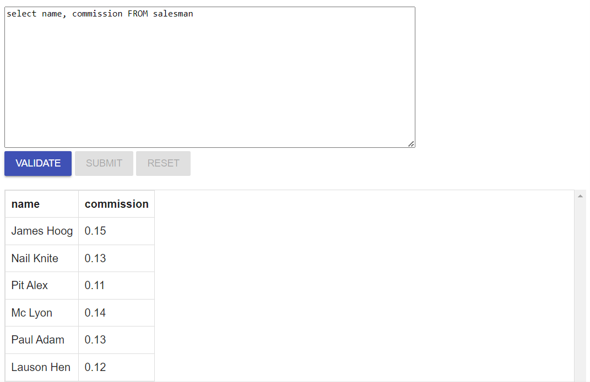

7.Write a query to display the columns in a specific order, such as order date, salesman ID, order number, and purchase amount for all orders

``sql
select ord_date, salesman_id, ord_no, purch_amt from orders
``

                            **RESULT**
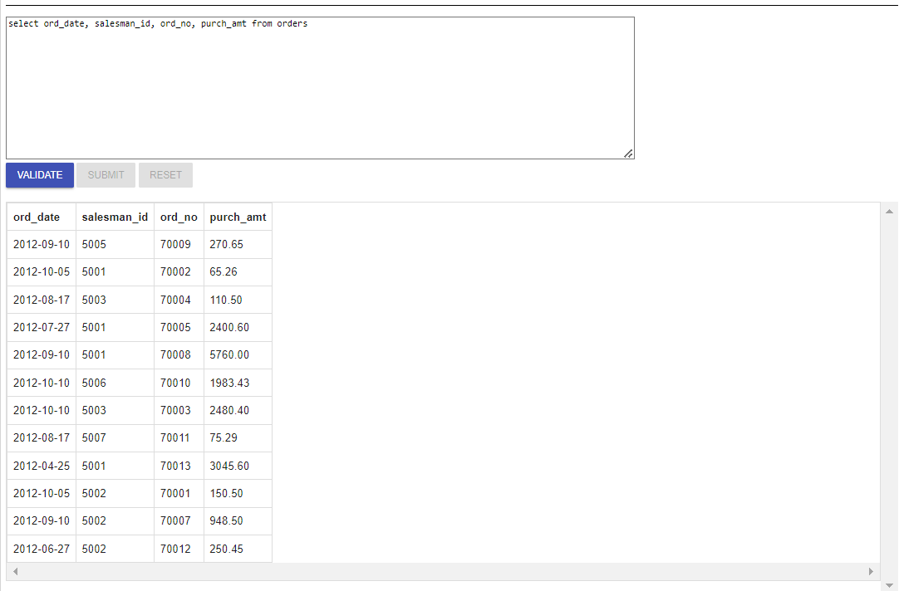

8.From the following table, write a SQL query to identify the unique salespeople ID. Return salesman_id

``sql
select distinct salesman_id from orders
``

                            **RESULT**

9.From the following table, write a SQL query to locate salespeople who live in the city of 'Paris'. Return salesperson's name, city.

``sql
select name,city from salesman 
where city='Paris'
``

                            **RESULT**
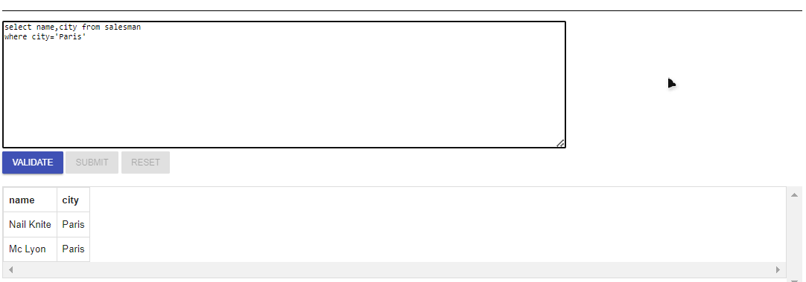

10.From the following table, write a SQL query to find customers whose grade is 200. Return customer_id, cust_name, city, grade, salesman_id.

``sql
select *from customer where grade=200
``

                            **RESULT**

11.From the following table, write a SQL query to find orders that are delivered by a salesperson with ID. 5001. Return ord_no, ord_date, purch_amt

``sql
select ord_no, ord_date, purch_amt from orders where salesman_id=5001
``

                            **RESULT**
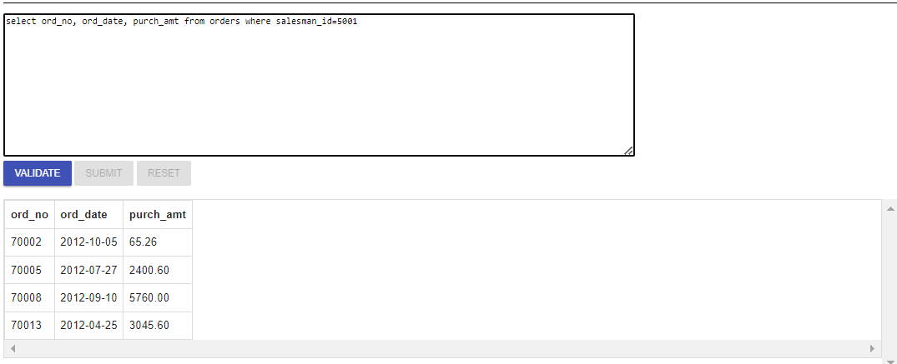

12.From the following table, write a SQL query to find the Nobel Prize winner(s) for the year 1970. Return year, subject and winner.

``sql
select year,subject,winner from nobel_win where year=1970
``

                            **RESULT**
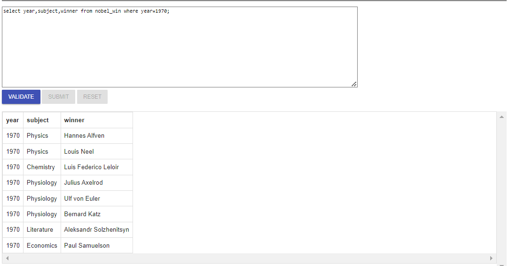

14.From the following table, write a SQL query to locate the Nobel Prize winner ‘Dennis Gabor'. Return year, subject.

``sql
select year, subject from nobel_win where winner = 'Dennis Gabor';
``

                            **RESULT**

15.From the following table, write a SQL query to find the Nobel Prize winners in the field of ‘Physics’ since 1950. Return winner

``sql
select winner from nobel_win where year>=1950 and subject='Physics';
``

                            **RESULT**
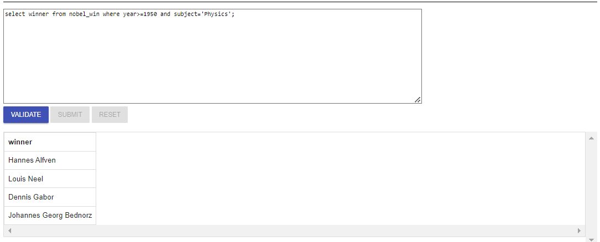

16.From the following table, write a SQL query to find the Nobel Prize winners in ‘Chemistry’ between the years 1965 and 1975. Begin and end values are included. Return year, subject, winner, and country

``sql
select year, subject, winner, country from nobel_win where subject = 'Chemistry' and year>=1965 AND year<=1975;
``

                            **RESULT**
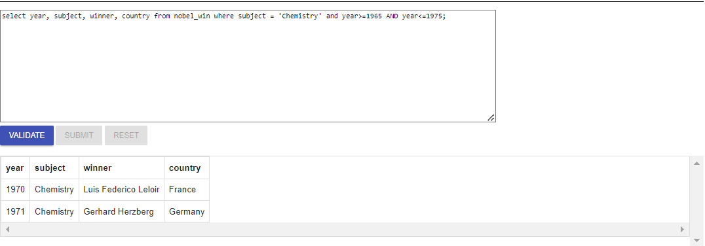

17.Write a SQL query to display all details of the Prime Ministerial winners after 1972 of Menachem Begin and Yitzhak Rabin

``sql
select * from nobel_win where year >1972 and winner in ('Menachem Begin','Yitzhak Rabin');
``

                            **RESULT**

18.From the following table, write a SQL query to retrieve the details of the winners whose first names match with the string ‘Louis’. Return year, subject, winner, country, and category

``sql
select * from nobel_win where winner like 'Louis %';
``

                            **RESULT**

19.From the following table, write a SQL query that combines the winners in Physics, 1970 and in Economics, 1971. Return year, subject, winner, country, and category.

``sql
select * from nobel_win  where (subject ='Physics' and year=1970) union (select * from nobel_win  where (subject ='Economics' and year=1971))
``

                            **RESULT**

20.From the following table, write a SQL query to find the Nobel Prize winners in 1970 excluding the subjects of Physiology and Economics. Return year, subject, winner, country, and category

``sql
select * from nobel_win where year=1970 and subject not in('Physiology','Economics')
``

                            **RESULT**
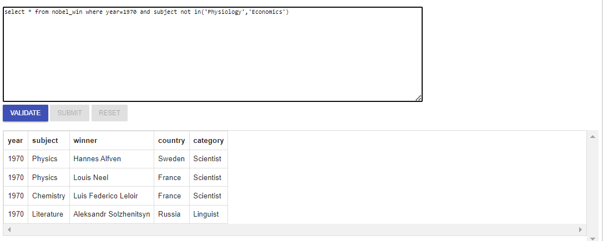

21.From the following table, write a SQL query to combine the winners in 'Physiology' before 1971 and winners in 'Peace' on or after 1974. Return year, subject, winner, country, and category.

``sql
select * from nobel_win where (subject ='Physiology' and year<1971) union (select * from nobel_win where (subject ='Peace' and year>=1974))
``

                            **RESULT**
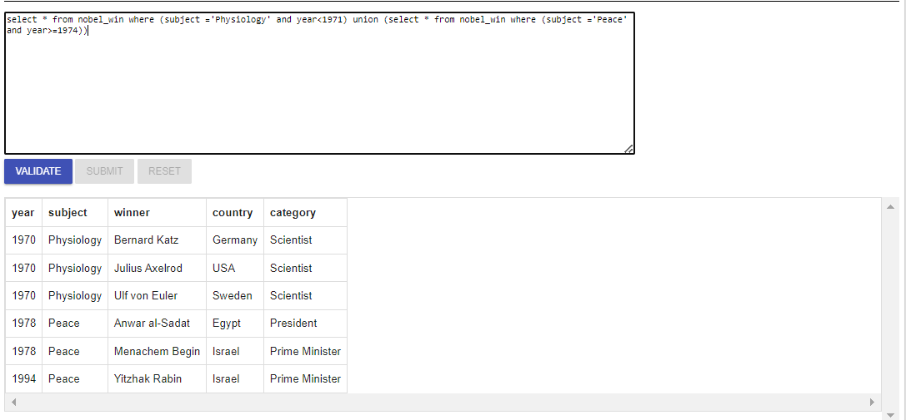

22.From the following table, write a SQL query to find the details of the Nobel Prize winner 'Johannes Georg Bednorz'. Return year, subject, winner, country, and category.

``sql
select * from nobel_win where winner='Johannes Georg Bednorz'
``

                            **RESULT**

23.From the following table, write a SQL query to find Nobel Prize winners for the subject that does not begin with the letter 'P'. Return year, subject, winner, country, and category. Order the result by year, descending and winner in ascending

``sql
select * from nobel_win where subject not like 'P%' order by year desc, winner
``

                            **RESULT**
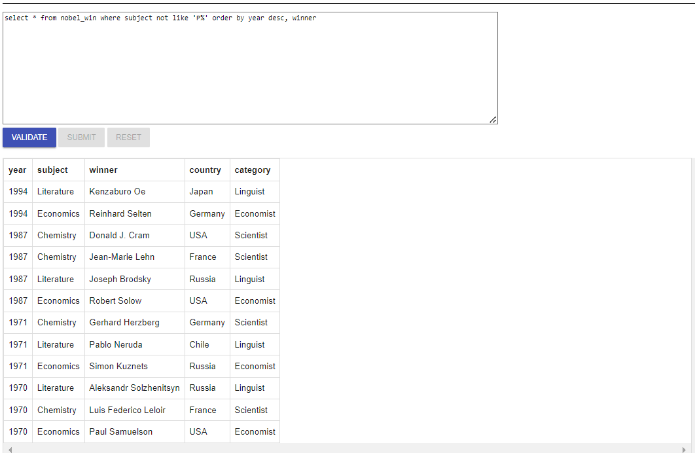

24.From the following table, write a SQL query to find the details of 1970 Nobel Prize winners. Order the results by subject, ascending except for 'Chemistry' and ‘Economics’ which will come at the end of the result set. Return year, subject, winner, country, and category. 

``sql
select * from nobel_win where year=1970 order by  case when subject in ('Economics','Chemistry') then 1 else 0 end asc, subject, winner
``

                            **RESULT**
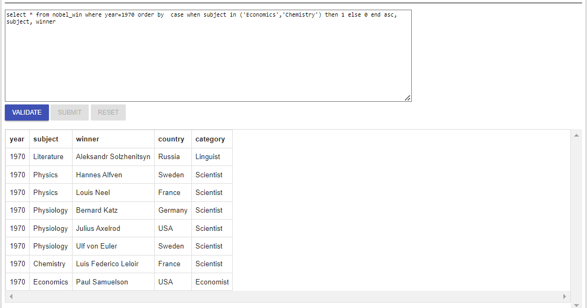

25.From the following table, write a SQL query to select a range of products whose price is in the range Rs.200 to Rs.600. Begin and end values are included. Return pro_id, pro_name, pro_price, and pro_com.

``sql
select * from item_mast where pro_price between 200 AND 600
``

                            **RESULT**

26.From the following table, write a SQL query to calculate the average price for a manufacturer code of 16. Return avg

``sql
select avg(pro_price) from item_mast where pro_com=16
``

                            **RESULT**

27.From the following table, write a SQL query to display the pro_name as 'Item Name' and pro_priceas 'Price in Rs.'

``sql
select pro_name as "Item Name", pro_price as "Price in Rs." from item_mast
``

                            **RESULT**
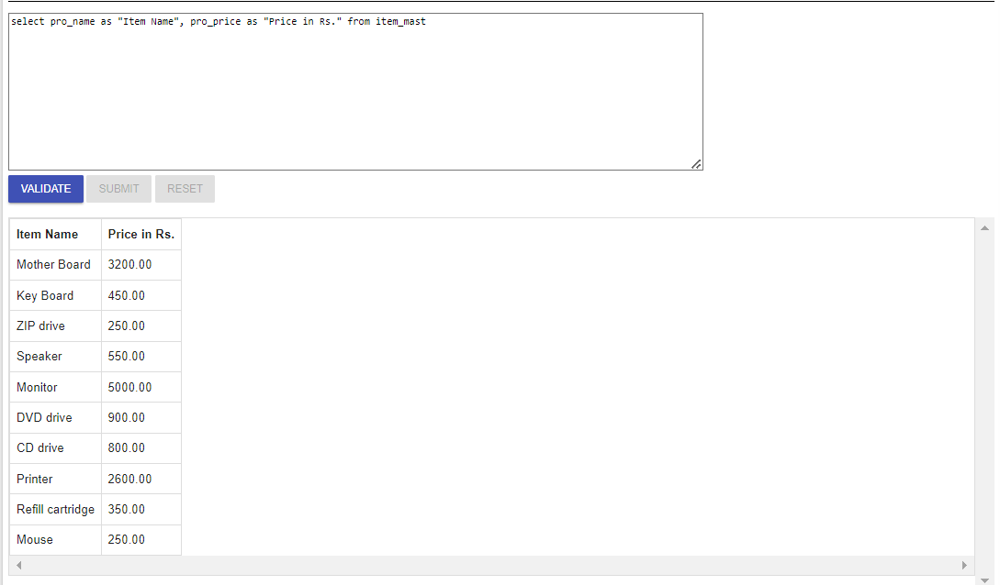

28.From the following table, write a SQL query to find the items whose prices are higher than or equal to $250. Order the result by product price in descending, then product name in ascending. Return pro_name and pro_price

``sql
select pro_name, pro_price from item_mast where pro_price >= 250 order by pro_price desc, pro_name
``

                            **RESULT**
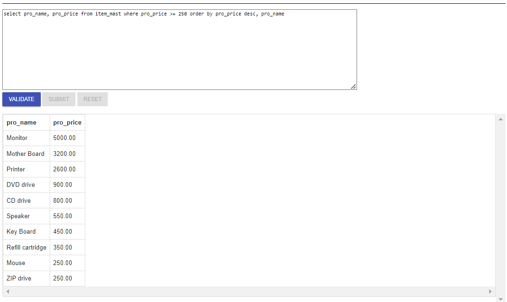

29.From the following table, write a SQL query to calculate average price of the items for each company. Return average price and company code

``sql
select avg(pro_price), pro_com from item_mast group by pro_com
``

                            **RESULT**
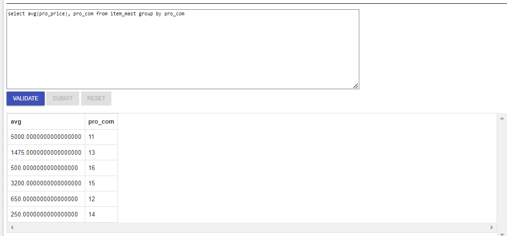

30.From the following table, write a SQL query to find the cheapest item(s). Return pro_name and, pro_price. 

``sql
select pro_name, pro_price from item_mast where pro_price = (select min(pro_price) from item_mast)
``

                            **RESULT**
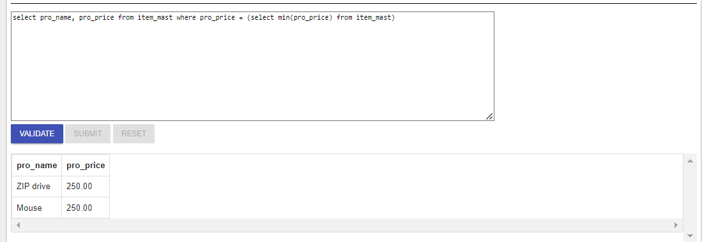

31.From the following table, write a SQL query to find the unique last name of all employees. Return emp_lname.

``sql
select distinct emp_lname from emp_details
``

                            **RESULT**
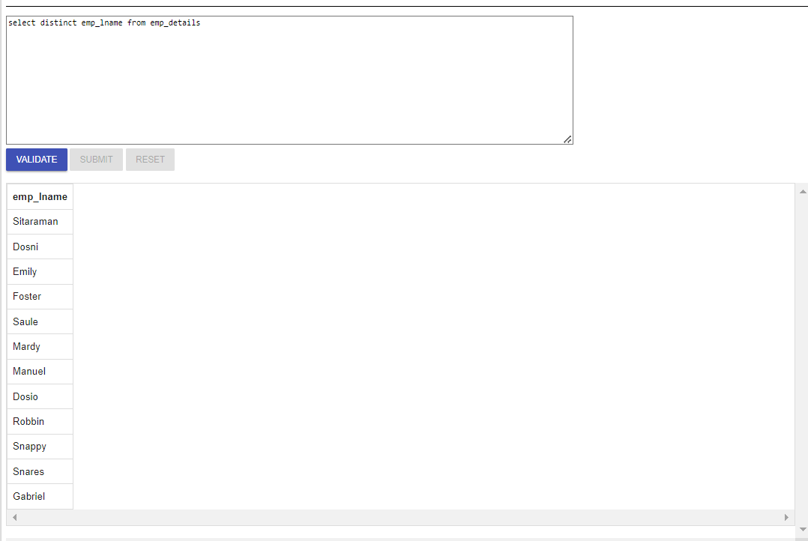

32.From the following table, write a SQL query to find the details of employees whose last name is 'Snares'. Return emp_idno, emp_fname, emp_lname, and emp_dept.

``sql
select * from emp_details where emp_lname= 'Snares' 
``

                            **RESULT**
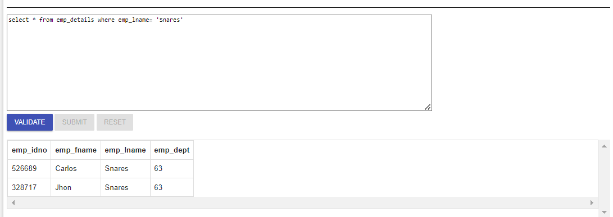

33.From the following table, write a SQL query to retrieve the details of the employees who work in the department 57. Return emp_idno, emp_fname, emp_lname and emp_dept.

``sql
select * from emp_details where emp_dept= 57    
``

                            **RESULT**
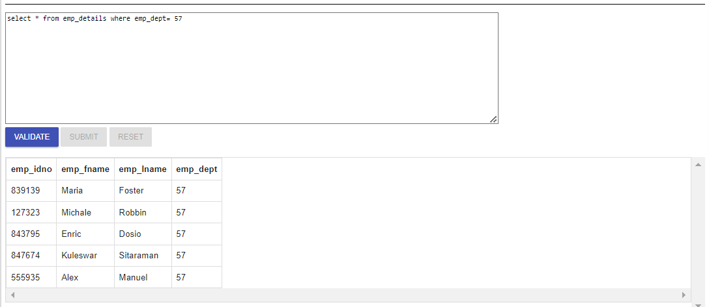