LESSON 4

1. From the following tables, write a SQL query to find the first name, last name, department number, and department name for each employee

```sql
select E.first_name , E.last_name , 
E.department_id , D.department_name 
from employees E 
join departments D 
on E.department_id = D.department_id

```

**RESULT**

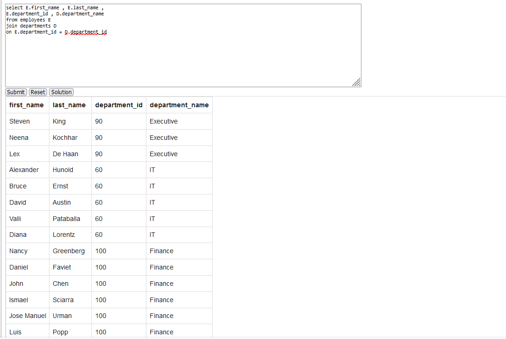

2. From the following tables, write a SQL query to find the first name, last name, department, city, and state province for each employee

```sql
select E.first_name,E.last_name, 
D.department_name, L.city, L.state_province
from employees E 
join departments D  
on E.department_id = D.department_id  
join locations L
on D.location_id = L.location_id

```

**RESULT**


3. From the following table, write a SQL query to find the first name, last name, salary, and job grade for all employees

```sql
select E.first_name, E.last_name, E.salary, J.grade_level
from employees E 
join job_grades J
on E.salary between J.lowest_sal and J.highest_sal

```

**RESULT**

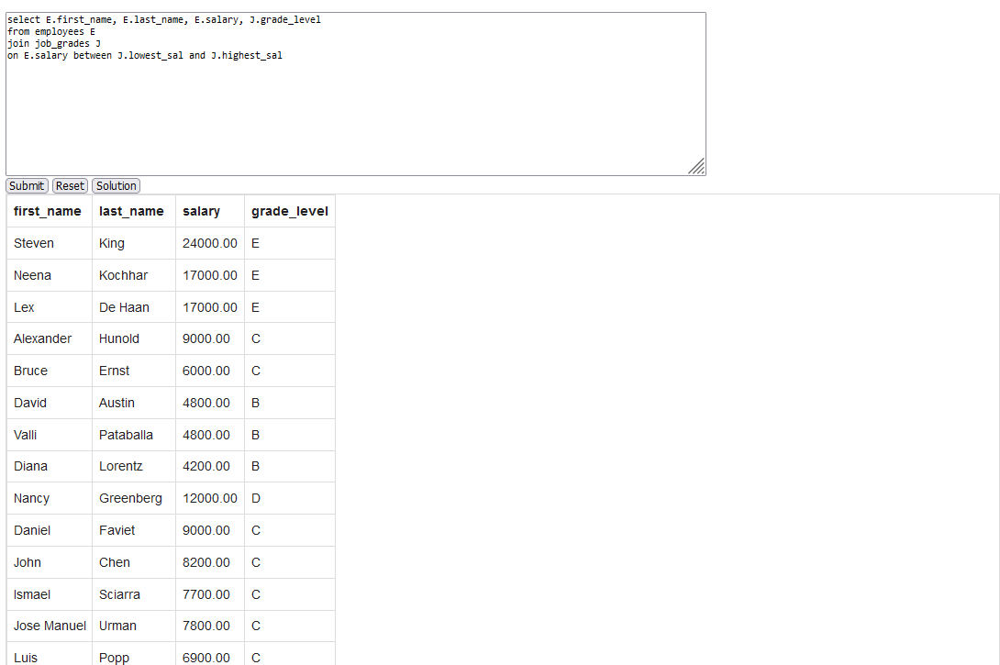

4. From the following tables, write a SQL query to find all those employees who work in department ID 80 or 40. Return first name, last name, department number and department nam

```sql
select E.first_name , E.last_name , 
E.department_id ,  D.department_name 
from employees E 
join departments D 
on E.department_id = D.department_id 
and E.department_id IN (80 , 40)
order by E.last_name
```

**RESULT**

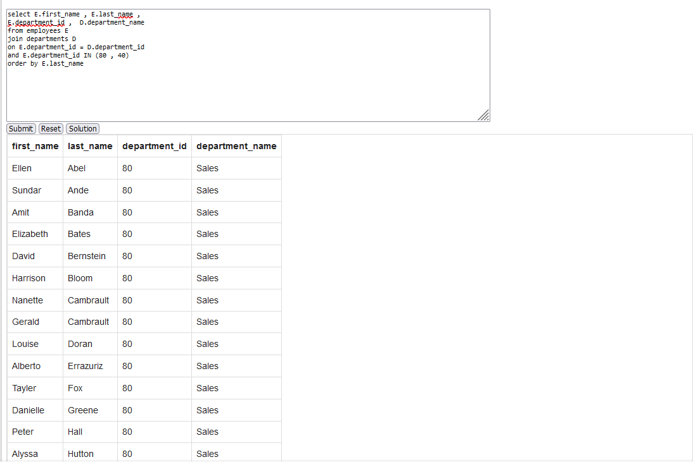

5. From the following tables, write a SQL query to find those employees whose first name contains the letter ‘z’. Return first name, last name, department, city, and state province.

```sql
select E.first_name,E.last_name,
D.department_name, L.city, L.state_province
from employees E 
join departments D  
on E.department_id = D.department_id 
join locations L 
on D.location_id = L.location_id 
where E.first_name like '%z%'
```

**RESULT**


6. From the following tables, write a SQL query to find all departments, including those without employees. Return first name, last name, department ID, department name

```sql
select E.first_name, E.last_name, D.department_id, D.department_name 
from employees E 
right outer join departments D
on E.department_id = D.department_id
```

**RESULT**

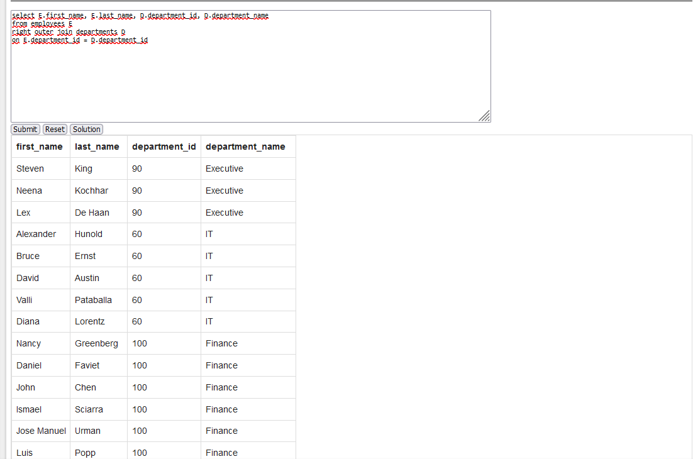

7. From the following table, write a SQL query to find the employees who earn less than the employee of ID 182. Return first name, last name and salary

```sql
select E.first_name, E.last_name, E.salary 
from employees E 
join employees S
on E.salary < S.salary 
and S.employee_id = 182
```

**RESULT**

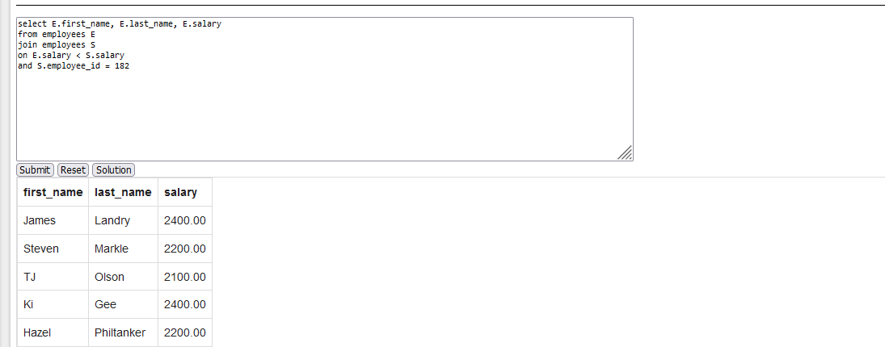

8. From the following table, write a SQL query to find the employees and their managers. Return the first name of the employee and manager

```sql
select E.first_name as "Employee Name", 
M.first_name as "Manager"
from employees E 
join employees M
on E.manager_id = M.employee_id
```

**RESULT**


9. From the following tables, write a SQL query to display the department name, city, and state province for each department

```sql
select D.department_name , L.city , L.state_province
from  departments D 
join locations L 
on  D.location_id = L.location_id
```

**RESULT**

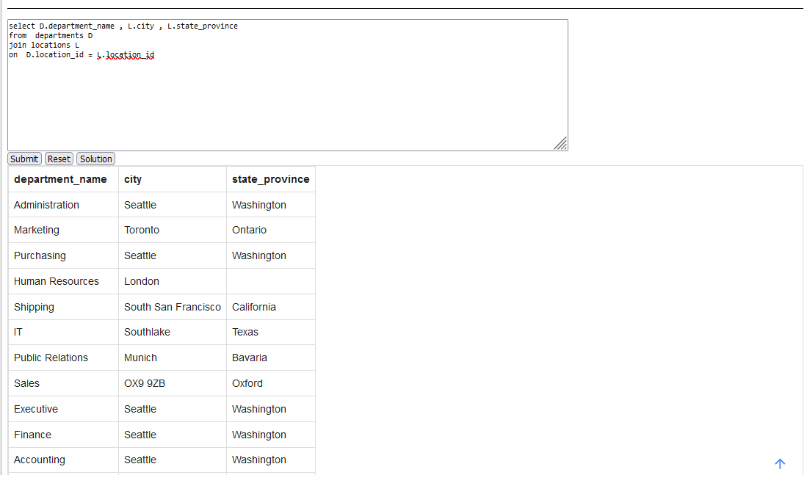

10. From the following tables, write a SQL query to find out which employees have or do not have a department. Return first name, last name, department ID, department name

```sql
select E.first_name, E.last_name, E.department_id, D.department_name 
from employees E 
left outer join departments D 
on E.department_id = D.department_id
```

**RESULT**

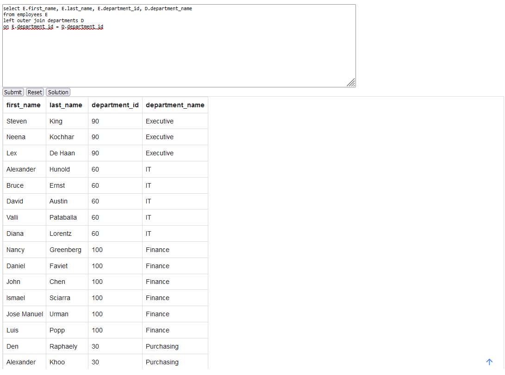

11. From the following table, write a SQL query to find the employees and their managers. Those managers do not work under any manager also appear in the list. Return the first name of the employee and manager.

```sql
select E.first_name as "Employee Name",
M.first_name as "Manager"
from employees E 
left outer join employees M
on E.manager_id = M.employee_id
```

**RESULT**

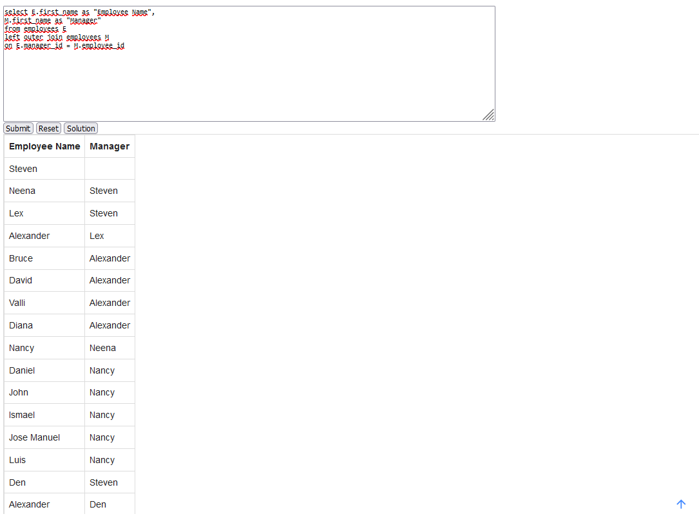

12. From the following tables, write a SQL query to find the employees who work in the same department as the employee with the last name Taylor. Return first name, last name and department ID

```sql
select E.first_name, E.last_name, E.department_id 
from employees E 
join employees S
on E.department_id = S.department_id
and S.last_name = 'Taylor'
```

**RESULT**


13. From the following tables, write a SQL query to find all employees who joined on or after 1st January 1993 and on or before 31 August 1997. Return job title, department name, employee name, and joining date of the job

```sql
select job_title, department_name, first_name || ' ' || last_name as Employee_name, start_date 
from job_history 
join jobs using (job_id) 
join departments using (department_id) 
join employees using (employee_id) 
where start_date>='1993-01-01' and start_date<='1997-08-31'
```

**RESULT**


14. From the following tables, write a SQL query to calculate the difference between the maximum salary of the job and the employee's salary. Return job title, employee name, and salary difference

```sql
select job_title, first_name || ' ' || last_name as Employee_name, 
max_salary-salary as salary_difference 
from employees 
natural join jobs
```

**RESULT**

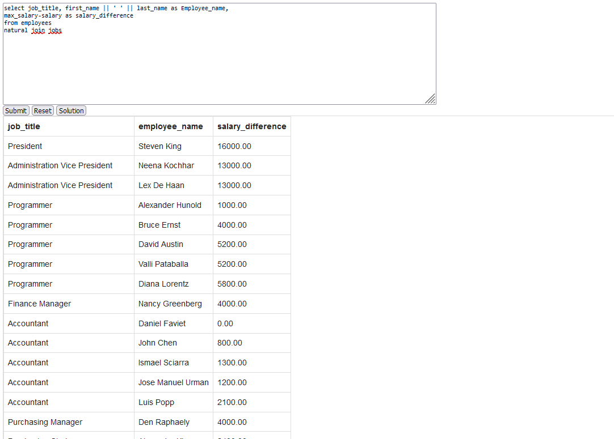

15. From the following table, write a SQL query to calculate the average salary, the number of employees receiving commissions in that department. Return department name, average salary and number of employees

```sql
select department_name, AVG(salary), COUNT(commission_pct) 
FROM departments 
join employees using (department_id) 
group by department_name
```

**RESULT**


16. From the following tables, write a SQL query to calculate the difference between the maximum salary and the salary of all the employees who work in the department of ID 80. Return job title, employee name and salary difference

```sql
select job_title, first_name || ' ' || last_name as Employee_name, 
max_salary-salary as salary_difference
from employees 
natural join jobs 
where department_id  = 80
```

**RESULT**

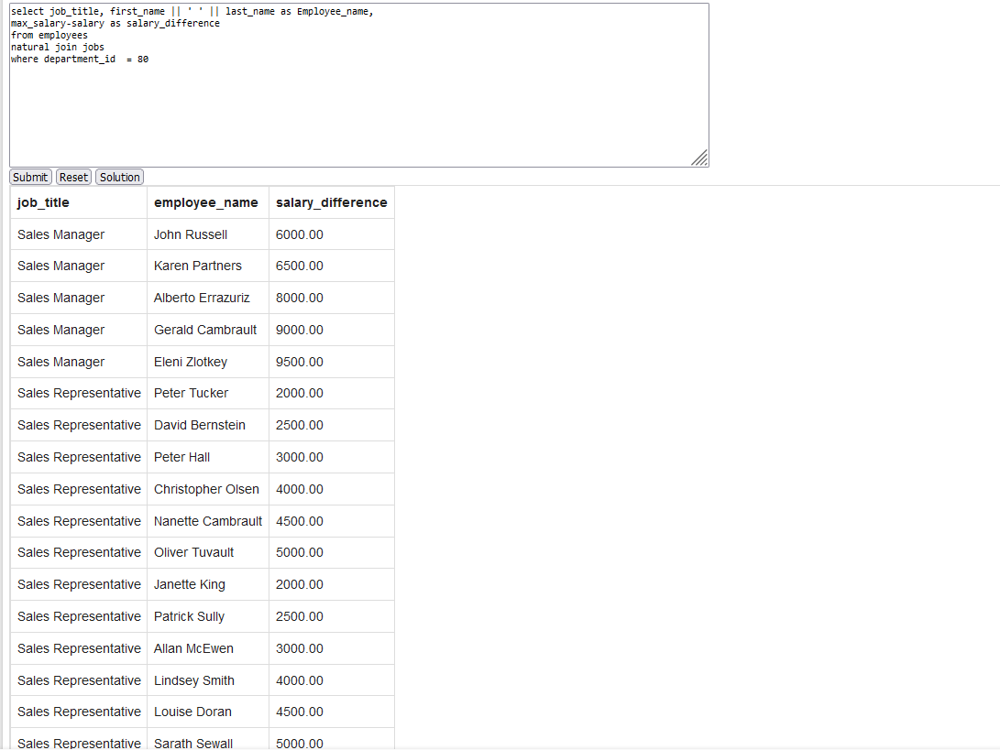

17. From the following table, write a SQL query to find the name of the country, city, and departments, which are running there

```sql
select country_name,city, department_name 
from countries 
join locations using (country_id) 
join departments using (location_id)
```

**RESULT**

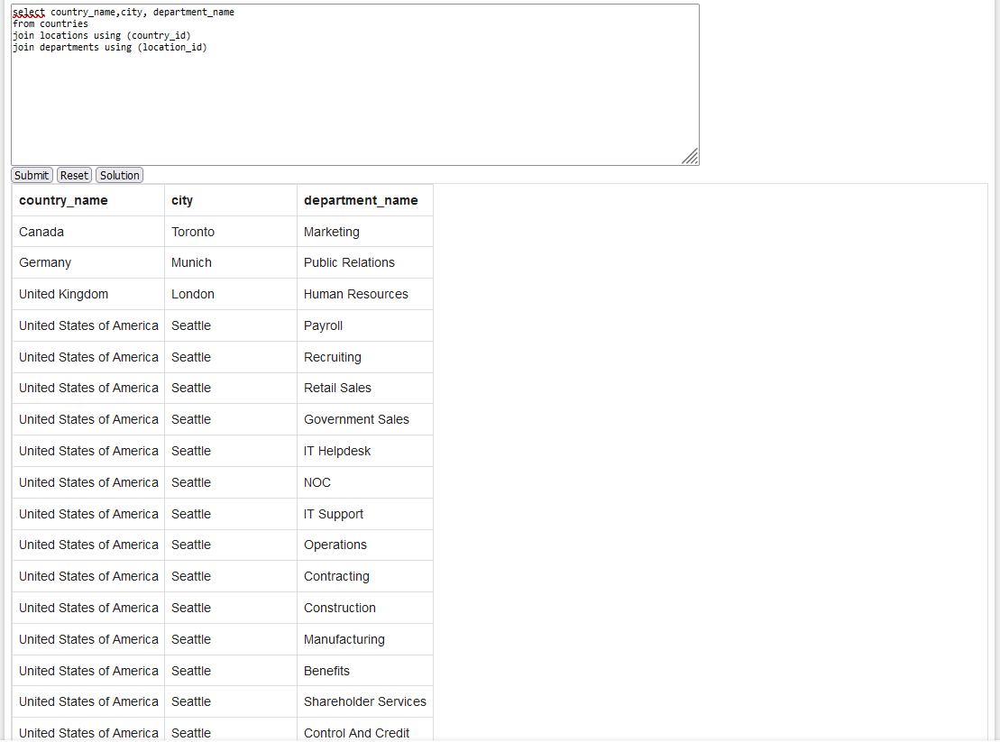

18. From the following tables, write a SQL query to find the department name and the full name (first and last name) of the manager.

```sql
select department_name, first_name || ' ' || last_name as name_of_manager
from departments D 
join employees E 
on (D.manager_id=E.employee_id)
```

**RESULT**


19. From the following table, write a SQL query to calculate the average salary of employees for each job title

```sql
select job_title, AVG(salary) 
from employees 
natural join jobs 
group by job_title
```

**RESULT**


20. From the following table, write a SQL query to find the employees who earn $12000 or more. Return employee ID, starting date, end date, job ID and department ID.

```sql
select a.*
from job_history a 
join employees m 
on (a.employee_id = m.employee_id)
where salary >= 12000
```

**RESULT**


21. From the following tables, write a SQL query to find out which departments have at least two employees. Group the result set on country name and city. Return country name, city, and number

```sql
select country_name,city, COUNT(department_id)
from countries 
join locations using (country_id) 
join departments using (location_id) 
where department_id in 
(select department_id 
from employees 
group by department_id 
having COUNT(department_id)>=2)
group by country_name,city
```

**RESULT**

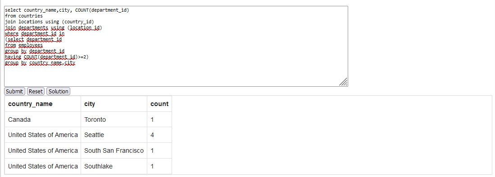

22. From the following tables, write a SQL query to find the department name, full name (first and last name) of the manager and their city.

```sql
select department_name, first_name || ' ' || last_name as name_of_manager, city 
from departments D 
join employees E 
on (D.manager_id=E.employee_id) 
join locations L using (location_id)
```

**RESULT**

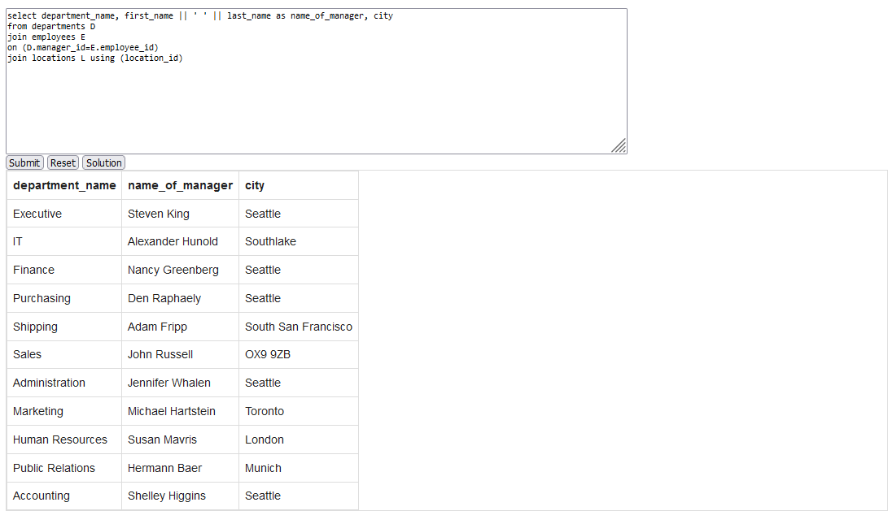

23. From the following tables, write a SQL query to calculate the number of days worked by employees in a department of ID 80. Return employee ID, job title, number of days worked.  

```sql
select employee_id, job_title, end_date-start_date DAYS 
from job_history 
natural join jobs 
where department_id=80
```

**RESULT**


24. From the following tables, write a SQL query to find full name (first and last name), and salary of all employees working in any department in the city of London.

```sql
select first_name || ' ' || last_name as Employee_name, salary
from employees 
join departments using (department_id) 
join  locations using (location_id) 
where  city = 'London'
```

**RESULT**


25. From the following tables, write a SQL query to find full name (first and last name), job title, start and end date of last jobs of employees who did not receive commissions

```sql

```

26. From the following tables, write a SQL query to find the department name, department ID, and number of employees in each department.

```sql
select d.department_name,
e.*
from departments d
join
(select count(employee_id),
department_id
from employees
group by department_id) e using (department_id)
```

**RESULT**

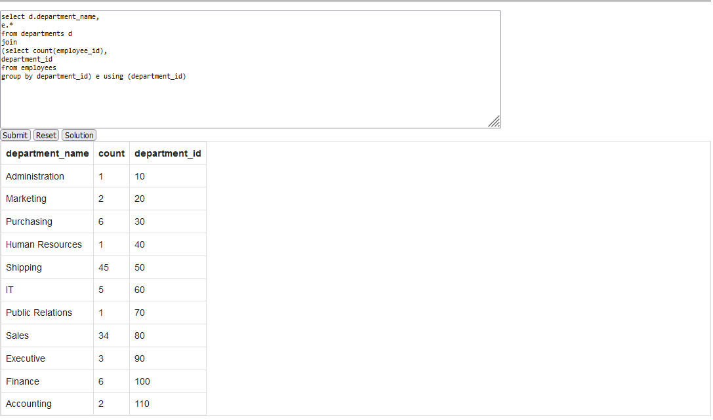

27. From the following tables, write a SQL query to find out the full name (first and last name) of the employee with an ID and the name of the country where he/she is currently employed.

```sql
select first_name || ' ' || last_name 
as Employee_name, employee_id, country_name 
from employees 
join departments 
using(department_id) 
join locations 
using( location_id) 
join countries 
using ( country_id)
```

**RESULT**

